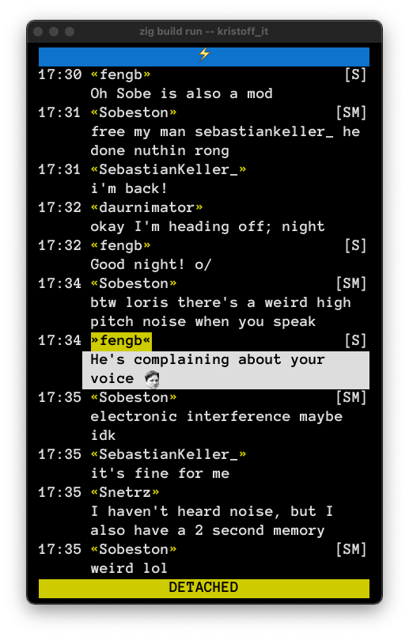

# bork
*A TUI chat client tailored for livecoding on Twitch, currently in alpha stage.*

### Main features
- Displays Twitch emotes in the terminal, **including your own custom emotes!**  
- Understands Twitch-specific concepts (subcriptions, gifted subs, ...). 
- Displays badges for your subs, mods, etc.
- Supports clearing chat and deletes messages from banned users. 
- Click on a message to highlight it and let your viewers know who you're relpying to. 

## Why?
Many livecoders show their chat feed on stream. It makes sense for the livecoding genre, since the content is text-heavy and you want viewers to be aware of all social interactions taking place, even when they put the video in full screen mode.

It's also common for livecoders to use terminal applications to show chat on screen, partially out of convenience, partially because of the appeal of the terminal aestetic. Unfortunately the most common solution, irssi, is an IRC client that can show basic Twitch messages, but that doesn't understand any of the Twitch-specific concepts such as subs, sub gifts, highlighted messages, etc.

Bork is designed to replace irssi for this usecase by providing all the functionality that isn't present in a general-purpose IRC client.

## Requirements
To see Twitch emotes in the terminal, you will need [Kitty](https://github.com/kovidgoyal/kitty), or any terminal emulator that supports the Kitty graphics protocol.
Bork will otherwise fallback to showing the emote name (eg "Kappa").

Support for more graphics protocols will be considered in the future.  
Protocols that will not be implemented:
- iTerm, because of abysmal performance when trying to draw even just a handful of emotes.

## Usage
todo

## Build
todo 

## Demo
https://youtu.be/Px8rVB3ZpKA
