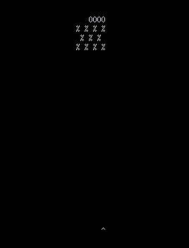

# zbox

A very minimal terminal UI library inspired by termbox. This exists primarily
as a UI library for a separate text editor project.


### Usage
see [examples](examples) for sample usage



### Features
* exposes some primitives for terminal setup/control
* exposes an interface to terminal printing/drawing that de-duplicates and
batches operations sent to the terminal.
* create and manipulate offscreen cell buffers with drawing and printing
primitives, compose them, and 'push' them out to the terminal.
* Simple input events

### Design Philosophy and differences from termbox
* Zig (possible C-API eventually)
* Prefer lack of features to external dependencies (no terminfo/termcap). 
Portability is arrived at by minimizing the interface to terminal primitives
to the most portable subset.
* input handling follows the above statement. different terminals communicate
hotkey modifiers differently. I hope to eventually support Ctrl as a modifier
portably and consistently, but currently do not. Mouse input will probably 
never be supported.
Parsing most input is currently the responsibility of the user.
* event handling should be compatible with zig's async IO. As such, this
intentionally avoids poll/signal handlers, and so `sigwinch` (terminal window
resize signal) is not used for window resizing.

### Portability & Stability
currently only tested on linux, but should be broadly posix compliant. Not
thoroughly tested in general, but everything seems to work in common terminals
like (ux)term, linux console, whatever crap ubuntu uses by default, kitty, and
alacritty.

Highly unlikely to work on windows given that we are not using libc (which could
do some mocking of linux syscalls related APIs on windows ala Cygwin). Planned to
at least support windows for putting the tty in raw mode, but will not translate
ANSI/VT control sequences to windows API calls. You'd have to use something like
windows terminal or mintty.

Still very rough, and probably broken in most places.

## API overview

```zig
const zbox = @import("zbox");
```

#### Interacting with the terminal

```zig
/// setup the tty and internal state of the library for use.
zbox.init(allocator: *Allocator) !void

/// restore tty to state before initialization and clean up internal library state.
zbox.deinit() void


/// request the size of the tty in characters. Can fail if the tty is in an unexpected state.
zbox.size() !struct { width: usize, height: usize }

// treat special hotkeys like ctrl-c, ctrl-d, ctrl-z, and ctrl-z as normal input
zbox.ignoreSignalInput() !void

/// allow the tty to handle the above hotkeys
zbox.handleSignalInput() !void

/// send VT control sequences for hiding and showing cursor, and clearing the terminal respectively
/// note: these will not be flushed to the terminal until the next call to `zbox.push()`
zbox.cursorShow() !void
zbox.cursorHide() !void
zbox.clear() !void


/// wait for the next event from the tty.
zbox.nextEvent() !zbox.Event

//TODO: document event structure

// render the given cell buffer to the tty.
zbox.push(Buffer)

```
#### Cell buffers

Cell buffers are an off-screen abstraction of the terminal. Rather than directly sending operations to the
system's terminal, you create, operate on, and compose cell buffers. The library itself also maintains its own
internal cell buffer so it knows what was drawn to the screen on the last 'push'. This is so that on the next push,
it can compare it to the last state and only generate drawing operations for the parts that have changed.

```zig
// allocate an initialize a new cell buffer with the given dimensions.
// the default cell this uses for initialization is a space character with no ANSI style attributes.
var buffer = zbox.Buffer.init(allocator,height,width) !zbox.Buffer

// free the buffer's backing memory
buffer.deinit()

// the height and width of the buffer respectively. users should not directly modify these
// see `buffer.resize()`
buffer.height: usize
buffer.width: usize

/// returns a copy of the cell at a given row and column offset, row and column offsets are 0-indexed
buffer.cell(row_num,col_num) Cell

/// returns a pointer to the cell at the given row and column offset
/// if the buffer that this is called on is const, the cell pointed to is also const
/// this will be invalidated after a call to `buffer.resize`
buffer.cellRef(row_num,col_num) *Cell
buffer.cellRef(row_num,col_num) *const Cell

/// returns a slice of cells representing the row at a given offset.
/// like `buffer.cellRef` the constness of the slice elements depends on the constness of `buffer`
/// also invalidated after any call to `buffer.resize()`
buffer.row(row_num) []Cell
buffer.row(row_num) []const Cell

/// fill the entire buffer with a given cell value.
buffer.fill(cell) void

/// resize and reallocate the memory for a buffer, truncating an filling dimension approriately
/// can fail on OOM
/// invalidates all outstanding row and cell references
buffer.resize(new_height,new_width) !void

// draw other_buffer on top of buffer at the given row and column offsets. Row and column offsets can
// be negative, and if the other buffer crosses the boundary of the target buffer, out of bounds
// data will be ignored.

buffer.blit(other_buffer, row_offset, col_offset) void
```
#### Buffer Cursors

in order to facilitate textual drawing, one can 'capture a cursor' at a given row and column, which can
be passed around and written to like a normal IO endpoint.

```zig
// buffer.cursorAt().writer().write() will not compile because 
// it captures the cursor as const, and write mutates the cursor's offset.
// must use intermediate variable for the cursor as follows:
var cursor = buffer.cursorAt(row_num,col_num) zbox.Buffer.WriteCursor
var writer = cursor.writer(); // std.io.Writer;
const bytes_written = try writer.write("hello");
```

by default, buffer cursors are 'row-truncating'; if you write beyond the right boundary of the buffer, characters
after the right boundary up to and including newline will be dropped, and input will proceed on the following row if one
exists. If there is no next row to write to, no more data will be written, and `write` will return a count of the
bytes written (including truncated/dropped bytes) up to that point.

However, cursors can also operate in a 'wrapped' mode, which is exactly what it sounds like. In wrapped mode,
writing beyond the right-most boundary of a row writes to the next line. Like a truncating cursor, writing stops
when the cursor tries to move below the last line.

```zig
var cursor = buffer.wrappedCursorAt(row_num,col_num) zbox.Buffer.WriteCursor
```

In both cases, cursors are structured to provide useful feedback about how much data was able to be written so that
interfaces revolving around text can properly scroll/page the text using the feedback from the `write` operation like
one would with a normal IO endpoint.

